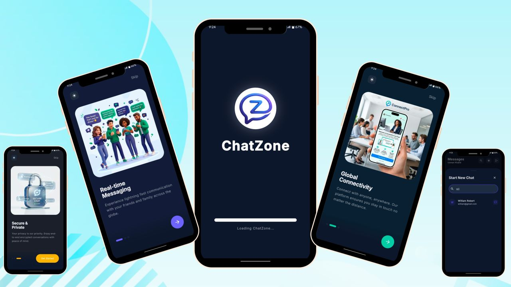
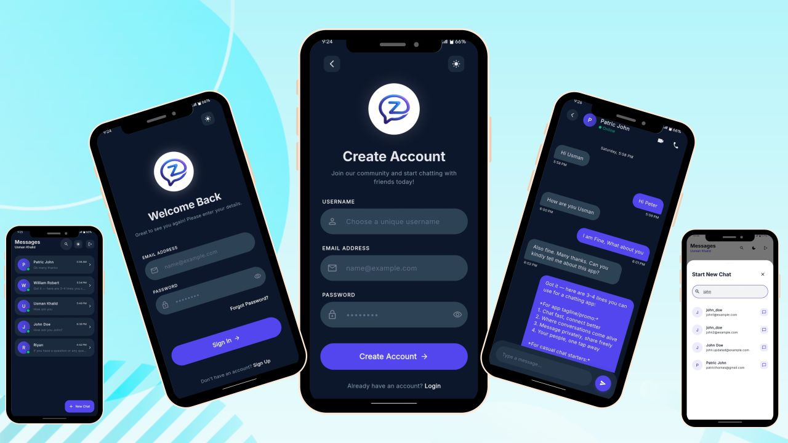
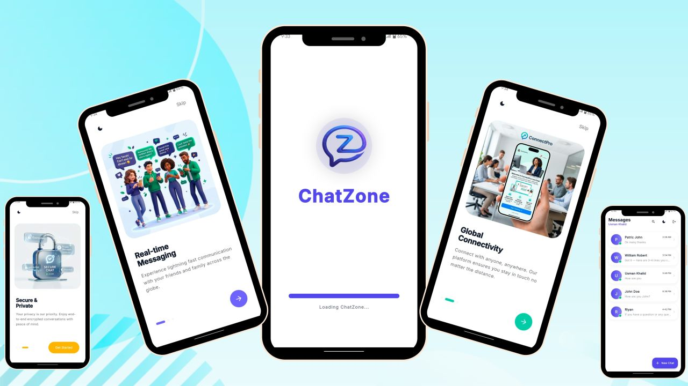
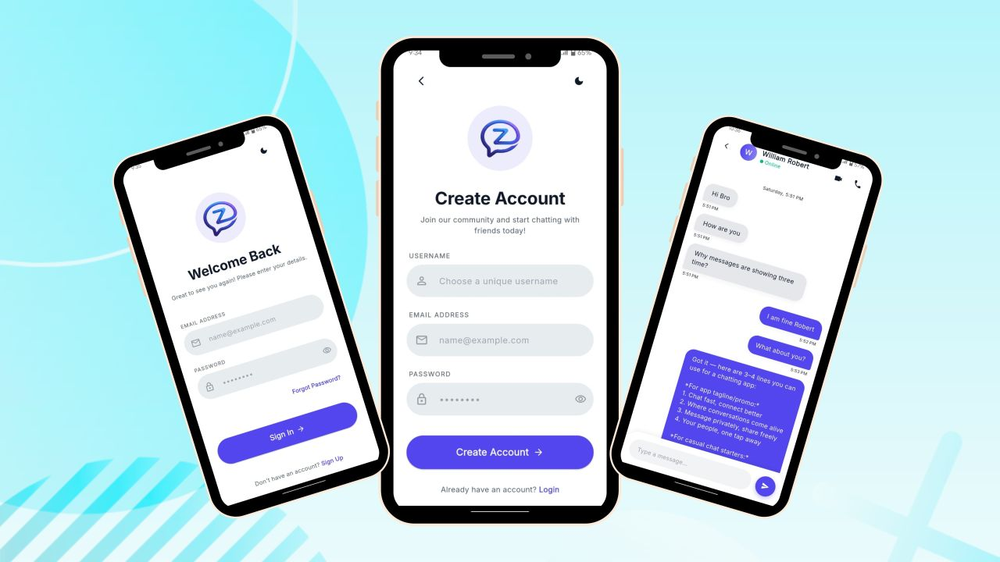

# 💬 ChatZone — Real-Time Chat Application

## 📱 About The Project

ChatZone is a modern real-time messaging application developed using Flutter and Node.js, designed to provide fast, secure, and seamless communication between users.

Built for an international client, the application delivers a production-ready chat experience with real-time messaging, friend management, chat rooms, and scalable backend architecture.

The project focuses on performance, scalability, and clean UI/UX while integrating Socket.IO for instant communication and MongoDB for reliable data management.

---

# 🌟 Project Highlights

- 💬 Real-Time Messaging System
- 👥 Friends & Social Interaction
- 🔐 Secure Authentication
- 📨 Personal Inbox & Chat Rooms
- ⚡ Instant Message Delivery
- ☁️ Scalable Backend APIs
- 📱 Responsive Flutter UI
- 🚀 Production-Ready Architecture

---

# ✨ Core Features

## 🔐 Authentication System

Users can:

- Create secure accounts
- Login & signup securely
- Manage user sessions
- Access protected chat features

---

## 👥 Friends & Social Features

The app includes:

- Add friends functionality
- Friends chat list
- Social interaction system
- Personalized user experience

---

## 💬 Real-Time Messaging

Powered by Socket.IO for seamless communication.

### Features

- Instant message delivery
- One-to-one chat
- Real-time chat synchronization
- Smooth messaging experience

---

## 📨 Chat Rooms & Inbox

Users can:

- Access personal inbox
- Manage chat conversations
- Join chat rooms
- Track messaging history

---

## 🎨 User Experience

Special attention was given to:

- Clean onboarding flow
- Modern UI/UX
- Smooth navigation
- Responsive design
- Fast app performance

---

# ⚙️ Technical Highlights

- Frontend & Backend Separation
- Real-Time Socket Communication
- Scalable REST APIs
- Production-Ready Architecture
- Cloud Deployment Integration
- Optimized Database Structure

---

# 🛠️ Tech Stack

| Technology | Usage |
|------------|-------|
| Flutter | Frontend Development |
| Node.js | Backend APIs |
| Express.js | Server Framework |
| Socket.IO | Real-Time Communication |
| MongoDB | Database |
| Render | Cloud Hosting |
| Swagger | API Documentation |
| VS Code | Development Environment |

---

# 🌍 Project Achievement

Successfully delivered a scalable real-time chat application for an international client with 100% client satisfaction.

---

# 📱 Application Screenshots

  

---

# 🚀 Future Improvements

- AI Chat Assistant
- Voice & Video Calling
- Message Reactions
- Media Sharing
- End-to-End Encryption
- Push Notifications

---

# 🤝 Let’s Connect

Open for Flutter development, scalable backend systems, and real-time application projects.

📩 Available for freelance & remote opportunities.

---

# ⭐ Support

If you like this project, don't forget to star the repository ⭐
